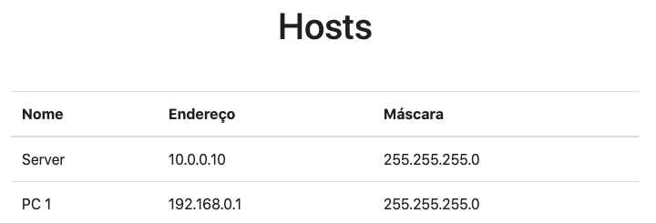
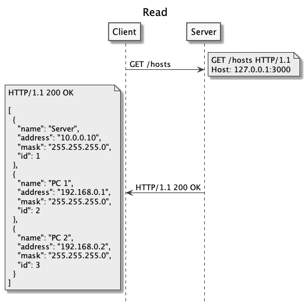
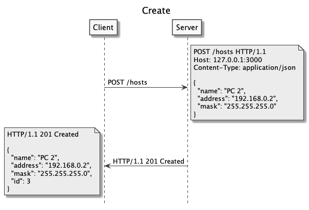
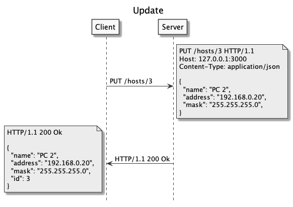
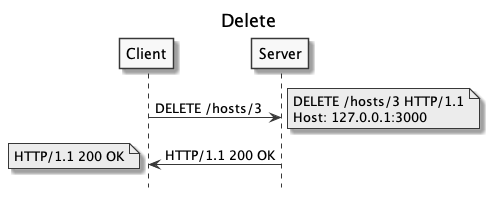

# Client Side Rendering

  - [Conteúdo Dinâmico](#conteúdo-dinâmico)
    - [Front](#front)
    - [Back](#back)
  - [Fetch API](#fetch-api)
    - [CRUD de Hosts](#crud-de-hosts)
    - [Read](#read)
    - [Create](#create)
    - [Update](#update)
    - [Delete](#delete)

## Conteúdo Dinâmico

---



```
hosts-app
├── back
│   ├── .gitignore
│   ├── db.json
│   ├── package-lock.json
│   ├── package.json
│   ├── resquest.http
│   └── src
│       └── index.js
└── front
    ├── index.html
    └── js
        ├── index.js
        └── services
            └── api.js
```

### Front

[](https://codesandbox.io/s/host-app-front-uvrug?fontsize=14&hidenavigation=1&theme=dark)

hosts-app/front/index.html:

```html

```

hosts-app/front/js/index.js:

```js

```

### Back

[](https://codesandbox.io/s/host-app-back-moeem?fontsize=14&hidenavigation=1&theme=dark)

REST API

| Método | Caminho              | Resposta                                     |
| ------ | -------------------- | -------------------------------------------- |
| POST   | `/hosts`             | Cria uma novo host                           |
| GET    | `/hosts`             | Retorna todas os hosts                       |
| GET    | `/hosts/1`           | Retorna o host de ID 1                       |
| PUT    | `/hosts/1`           | Atualiza o host de ID 1                      |
| DELETE | `/hosts/1`           | Exclui o host de ID 1                        |


hosts-app/back/db.json:

```js

```

hosts-app/back/src/index.js:

```js

```

[json-server](https://github.com/typicode/json-server):

```
$ npm init -y
$ npm install json-server
```

hosts-app/back/package.json:

```json

```

```
$ npm start
```

[http://localhost:3000/hosts](http://localhost:3000/hosts):

```json
[
  {
    "name": "Server",
    "address": "10.0.0.10",
    "mask": "255.255.255.0",
    "id": 1
  },
  {
    "name": "PC 1",
    "address": "192.168.0.1",
    "mask": "255.255.255.0",
    "id": 2
  }
]
```

back/request.http ([VS Code - Rest Client](https://marketplace.visualstudio.com/items?itemName=humao.rest-client)):

```
### Create Host

### Read Hosts

GET http://localhost:3000/hosts

### Read Host by ID

### Update Host

### Delete Host
```

## Fetch API

---

front/js/services/api.js:
```js
const domain = 'http://localhost:3000';

async function create(resource, data) {}

async function read(resource) {}

async function update(resource, data) {}

async function destroy(resource) {}

export default { create, read, update, destroy };
```

### Read



Codesandbox: [Read](https://moeem.sse.codesandbox.io/hosts)

```
### Read Hosts

GET http://localhost:3000/hosts
```

```js
async function read(resource) {
  const res = await fetch(`${domain}${resource}`);

  return await res.json();
}
```

```js
api.read('/hosts');
```

### Create



Codesandbox: [Create (REQBIN)](https://reqbin.com/75sw4s9x)

```
### Create Host

POST http://localhost:3000/hosts
Content-Type: application/json

{
  "name": "PC 2",
  "address": "192.168.0.2",
  "mask": "255.255.255.0"
}
```

```js
async function create(resource, data) {
  const res = await fetch(`${domain}${resource}`, {
    method: 'post',
    body: JSON.stringify(data),
    headers: {
      'Content-Type': 'application/json; charset=UTF-8',
    },
  });

  return await res.json();
}
```

```js
const host = {
  name: "PC 2",
  address: "192.168.0.2",
  mask: "255.255.255.0"
}

api.create('/hosts', host);
```

### Update



Codesandbox: [Upadte (REQBIN)](https://reqbin.com/rmigtirs)

```
### Update Host

PUT http://localhost:3000/hosts/3
Content-Type: application/json

{
  "name": "PC 2",
  "address": "192.168.0.20",
  "mask": "255.255.255.0"
}
```

```js
async function update(resource, data) {
  const res = await fetch(`${domain}${resource}`, {
    method: 'put',
    body: JSON.stringify(data),
    headers: {
      'Content-Type': 'application/json; charset=UTF-8',
    },
  });

  return await res.json();
}
```

```js
const host = {
  name: "PC 2",
  address: "192.168.0.20",
  mask: "255.255.255.0"
}

api.update('/hosts/3', host);
```

### Delete



Codesandbox: [Delete (REQBIN)](https://reqbin.com/8cwfroas)

```
### Delete Host

DELETE http://localhost:3000/hosts/3
```

```js
async function destroy(resource) {
  await fetch(`${domain}${resource}`, {
    method: 'delete',
  });
}
```

```js
api.destroy('/hosts/1');
```
