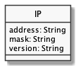

# API do JavaScript

  - [Definição de Módulos](#definição-de-módulos)
  - [String](#string)
    - [Criação](#criação)
    - [Casos Especiais](#casos-especiais)
    - [Caracteres especiais](#caracteres-especiais)
    - [Concatenação e Template literals](#concatenação-e-template-literals)
    - [Objeto String](#objeto-string)
  - [Array](#array)
    - [Criação](#criação-1)
    - [Acesso e Alteração](#acesso-e-alteração)
    - [Tipos Múltiplos](#tipos-múltiplos)
    - [Spread Operator](#spread-operator)
    - [Iteração](#iteração)
    - [Objeto Array](#objeto-array)
  - [JSON](#json)
    - [Criação](#criação-2)
    - [Acesso e Alteração](#acesso-e-alteração-1)
    - [Spread properties](#spread-properties)
    - [Property Shorthand](#property-shorthand)
    - [Iteração](#iteração-1)
    - [Objeto JSON](#objeto-json)

## [Definição de Módulos](https://ifpb.github.io/javascript-guide/ecma/modules/)

---

```js

```

- [Common Javascript - CJS](https://nodejs.org/api/modules.html)
- [ECMAScript Modules - ESM](https://nodejs.org/api/esm.html)

**CENÁRIOS**

```
src
├── lib.js
└── main.js
```

|     | Uma Função | Várias Funções |
| --- | ---------- | -------------- |
| CJS | 1.1        | 2.1            |
| ESM | 1.2        | 2.2            |

**CENÁRIO 1.1 - Uma função no CJS**

src/lib.js:

```js

```

src/main.js:

```js

```

**CENÁRIO 1.2 - Uma função no ESM**

src/lib.js:

```js

```

src/main.js:

```js

```

**CENÁRIO 2.1 - Várias funções no CJS**

src/lib.js:

```js

```

src/main.js:

```js

```

**CENÁRIO 2.2 - Várias funções no ESM**

src/lib.js:

```js

```

src/main.js:

```js

```

**RESUMO**

|     | Uma Função                                               | Várias Funções                                                                 |
| --- | -------------------------------------------------------- | ------------------------------------------------------------------------------ |
| CJS | `module.exports = sum`<br>`const sum = require('./lib')` | `module.exports = { sum, minus }`<br>`const { sum, minus } = require('./lib')` |
| ESM | `export default sum;`<br>`import sum from './lib'`       | `export { sum, minus }`<br>`import { sum, minus } from './lib'`                |

> **Warning:** To load an ES module, set "type": "module" in the package.json or use the .mjs extension.

```json

```

## String

---

### Criação

```js
console.log('h'); //=> "h"
console.log('hello world'); //=> "hello world"
console.log("hello world"); //=> "hello world"
console.log(`hello world`); //=> "hello world"
console.log(String('hello world')); //=> "hello world"
console.log(new String('hello world')); //=> "hello world"
```

### Casos Especiais

```js
console.log(''); //=> ""
console.log(""); //=> ""
console.log("hello' world"); //=> "hello\' world"
```

### Caracteres especiais

```js
console.log("hello\' world"); //=> "hello\' world"
console.log('hello\nworld'); //=> "hello\nworld"
console.log('I \u2661 JavaScript!'); //=> "I ♡ JavaScript!"
```

### Concatenação e Template literals

```js
const name = 'John';
console.log('Hello ' + name); //=> "Hello John"
```

```js
const name = 'John';
const email = 'john@email.com';
const id = '1';

const row =
  '<tr><td>' + id + '</td><td>' + name + '</td><td>' + email + '</td></tr>';

console.log(row);
//=> "<tr><td>1</td><td>John</td><td>john@email.com</td></tr>"
```

```js
const name = 'John';
const email = 'john@email.com';
const id = '1';

const row = `<tr><td>${id}</td><td>${name}</td><td>${email}</td></tr>`;

console.log(row);
//=> "<tr><td>1</td><td>John</td><td>john@email.com</td></tr>"
```

### Objeto String

Property: `length`

```js
console.log('lorem ipsum'.length); //=> 11
```

Methods: `includes`, `repeat`, `startsWith`, `endsWith`, `substr`, `substring`, `slice`, `split`, `toLowerCase`, `toUpperCase`, `match`, `replace`, `search`, `trim`, `padStart`

```js
console.log('lorem ipsum'.includes('lorem')); //=> true
console.log('lorem ipsum'.includes('dolor')); //=> false
```

```js
console.log('hello'.repeat(3)); //=> "hellohellohello"
console.log('hello'.repeat(-3)); //=> RangerError
```

```js
console.log('lorem ipsum'.substr(1, 2)); //=> "or"
console.log('lorem ipsum'.substr(1)); //=> "orem ipsum"
```

```js
console.log('lorem ipsum'.substring(1, 2)); //=> "o"
console.log('lorem ipsum'.substring(1)); //=> "orem ipsum"
```

```js
console.log('lorem ipsum'.slice(1, 2)); //=> "o"
console.log('lorem ipsum'.slice(1)); //=> "orem ipsum"
```

```js
console.log('lorem ipsum'.split('')); //=> [ "l", "o", "r", "e", "m", " ", "i", "p", "s", "u", "m" ]
console.log('lorem ipsum'.split(' ')); //=> [ "lorem", "ipsum" ]
console.log('lorem ipsum dolor'.split(' ', 1)); //=> [ "lorem" ]
console.log('lorem\nipsum-dolor'.split(/[-\n]/g)); //=> [ "lorem", "ipsum", "dolor" ]
```

```js
console.log('lorem ipsum'.match(/\w+/g)); //=> [ "lorem", "ipsum" ]
```

```js
console.log('lorem ipsum'.replace('lorem', 'LOREM')); //=> "LOREM ipsum"
```

```js
console.log('lorem ipsum'.search('lorem')); //=> 0
```

```js
console.log('LOREM IPSUM'.toLowerCase()); //=> "lorem ipsum"
```

```js
console.log('lorem ipsum'.toUpperCase()); //=> "LOREM IPSUM"
```

```js
console.log('  lorem  ipsum  '.trim()); //=> "lorem  ipsum"
```

```js
console.log('10'.padStart(4)); //=> "  10"
console.log('10'.padStart(4, 0)); //=> "0010"
```

```js
console.log('lorem ipsum'.startsWith('lorem')); //=> true
```

```js
console.log('lorem ipsum'.endsWith('ipsum')); //=> true
```

## Array

---

### Criação

```js
const numbers = [1, 2, 4, 7];

console.log(numbers); //=> [ 1, 2, 4, 7 ]
```

```js
const numbers = [];

numbers[0] = 10;
numbers[1] = 20;
numbers[10] = 100;

console.log(numbers); //=> [ 10, 20, , , , , , , , , 100 ]
```

### Acesso e Alteração

```js
const numbers = [1, 2, 4, 7];

console.log(numbers[0]); //=> 1
console.log(numbers[3]); //=> 7
console.log(numbers[4]); //=> undefined
console.log(numbers); //=> [ 1, 2, 4, 7 ]
```

```js
const numbers = [1, 2, 4, 7];

// change value
numbers[2] = 5;

// add value
numbers[4] = 10;
console.log(numbers); //=> [ 1, 2, 5, 7, 10 ]

// delete value
delete numbers[4];
console.log(numbers); //=> [ 1, 2, 5, 7,  ]
```

### Tipos Múltiplos

```js
const values = [1, 'John', true, null, [1, 2]];
console.log(values[1]); //=> "John"
console.log(values[4]); //=> [1, 2]
console.log(values[4][1]); //=> 2
```

### Spread Operator

```js
const numbers = [1, 2, 3];
console.log([...numbers, 4, 5]); //=> [ 1, 2, 3, 4, 5 ]
```

### Iteração

for

```js
const numbers = [1, 2, 4];
let result = '';

for (const flag = 0; flag < numbers.length; flag++) {
  result += numbers[flag] + ' ';
}

console.log(result); //=> "1 2 4 "
```

for..in

```js
const numbers = [1, 2, 4];
let result = '';

for (const index in numbers) {
  result += number[index] + ' ';
}

console.log(result); //=> "1 2 4 "
```

for..of

```js
const numbers = [1, 2, 4];
let result = '';

for (const value of numbers) {
  result += value + ' ';
}

console.log(result); //=> "1 2 4 "
```

### Objeto Array

Property: `length`

```js
const numbers = [1, 2, 3];
console.log(numbers.length); //=> 3
```

Mutator: `push()`, `unshift()`, `pop()`, `shift()`, `reverse()`, `sort()`, `splice()`

```js
const numbers = [1, 2, 3];
console.log(numbers.push(4)); //=> 4
console.log(numbers); //=> [ 1, 2, 3, 4 ]
```

```js
const numbers = [1, 2, 3];
console.log(numbers.unshift(0)); //=> 4
console.log(numbers); //=> [ 0, 1, 2, 3 ]
```

```js
const numbers = [1, 2, 3];
console.log(numbers.pop()); //=> 3
console.log(numbers); //=> [ 1, 2 ]
```

```js
const numbers = [1, 2, 3];
console.log(numbers.shift()); //=> 1
console.log(numbers); //=> [ 2, 3 ]
```

```js
const numbers = [1, 2, 3];
console.log(numbers.reverse()); //=> [ 3, 2, 1 ]
console.log(numbers); //=> [ 3, 2, 1 ]
```

```js
const numbers = [3, 1, 2];
console.log(numbers.sort()); //=> [ 1, 2, 3 ]
console.log(numbers); //=> [ 1, 2, 3 ]
```

```js
const numbers = [1, 2, 3];
console.log(numbers.splice(1, 2)); //=> [ 2, 3 ]
console.log(numbers); //=> [1]
```

Accessor: `includes()`, `join()`, `slice()`

```js
console.log([1, 2, 3].includes(1)); //=> true
```

```js
console.log([1, 2, 3].join(' ')); //=> "1 2 3"
```

```js
console.log([1, 2, 3].slice(1, 2)); //=> 2
```

Iteration: `map()`, `filter()`, `reduce()`, `every()`, `some()`

```js
const array = [1, 2, 3, 4, 5, 6];
console.log(array.map((value) => value * 2)); //=> [ 2, 4, 6, 8, 10, 12 ]
```

```js
const array = [1, 2, 3, 4, 5, 6];
console.log(array.filter((value) => value % 2 !== 0)); //=> [ 1, 3, 5 ]
```

```js
const array = [1, 2, 3, 4, 5, 6];
console.log(array.reduce((addition, value) => addition + value, 0)); //=> 21
```

```js
const array = [2, 4, 6];
console.log(array.every((value) => value % 2 == 0)); //=> true
```

```js
const array = [1, 2, 3, 4, 5, 6];
console.log(array.some((value) => value % 2 == 0)); //=> true
```

## JSON

---

### Criação

| NAME    | EMAIL             |
| ------- | ----------------- |
| fulano  | fulano@gmail.com  |
| sicrano | sicrano@gmail.com |

Quoted (.json, .js):

```json
[
  {
    "name": "fulano",
    "email": "fulano@gmail.com",
  },
  {
    "name": "sicrano",
    "email": "sicrano@gmail.com",
  },
]
```

Unquoted (.js):

```js
const students = [
  {
    name: 'fulano',
    email: 'fulano@gmail.com',
  },
  {
    name: 'sicrano',
    email: 'sicrano@gmail.com',
  },
];
```

Indexed & Unquoted (.js):

```js
const students = {
  20181234: {
    name: 'fulano',
    email: 'fulano@gmail.com',
  },
  20181235: {
    name: 'sicrano',
    email: 'sicrano@gmail.com',
  },
};
```

[http://ip-api.com/json/8.8.8.8](http://ip-api.com/json/8.8.8.8) (IP API: [doc](http://ip-api.com/docs/), [json](http://ip-api.com/docs/api:json)):

```json
{
  "as":"AS15169 Google Inc.",
  "city":"Mountain View",
  "country":"United States",
  "countryCode":"US",
  "isp":"Google",
  "lat":37.4229,
  "lon":-122.085,
  "org":"Google",
  "query":"8.8.8.8",
  "region":"CA",
  "regionName":"California",
  "status":"success",
  "timezone":"America/Los_Angeles",
  "zip":""
}
```

### Acesso e Alteração



```js
const ip = { address: '192.168.0.2', mask: '255.255.255.0' };

console.log(ip); //=> { address: "192.168.0.2", mask: "255.255.255.0" }
console.log(ip.address); //=> "192.168.0.2"
console.log(ip['address']); //=> "192.168.0.2"
```

```js
// add property
ip.version = 'v6';
console.log(ip); //=> { address: "192.168.0.2", mask: "255.255.255.0", version: "v6" }
console.log(ip.version); //=> "v6"

// change property
ip.version = 'v4';
console.log(ip); //=> { address: "192.168.0.2", mask: "255.255.255.0", version: "v4" }
console.log(ip.version); //=> "v4"

// delete property
delete ip.version;
console.log(ip); //=> { address: "192.168.0.2", mask: "255.255.255.0" }
console.log(ip.version); //=> undefined
```

### Spread properties

```js
const ip = { address: '192.168.0.2', mask: '255.255.255.0' };
console.log({ ...ip, version: 'v4' });
//=> {address: "192.168.0.2", mask: "255.255.255.0", version: "v4"}
```

### Property Shorthand

```js
const address = '192.168.0.2';
const mask = '255.255.255.0';
const version = 'v4';
console.log({ address: address, mask: mask, version: version });
console.log({ address, mask, version });
//=> {address: "192.168.0.2", mask: "255.255.255.0", version: "v4"}
```

### Iteração

```js
const ips = [
  { address: '192.168.0.2', mask: '255.255.255.0' },
  { address: '192.168.0.10', mask: '255.255.255.0' },
  { address: '192.168.0.26', mask: '255.255.255.0' },
];

for (const ip of ips) {
  console.log(ip.address + '/' + ip.mask);
}
//=>
// "192.168.0.2/255.255.255.0"
// "192.168.0.10/255.255.255.0"
// "192.168.0.26/255.255.255.0"
```

```js
const ips = {
  database: { address: '192.168.0.2', mask: '255.255.255.0' },
  dns: { address: '192.168.0.10', mask: '255.255.255.0' },
  http: { address: '192.168.0.26', mask: '255.255.255.0' },
};

for (const host in ips) {
  console.log(ips[host].address + '/' + ips[host].mask);
}
//=>
// "192.168.0.2/255.255.255.0"
// "192.168.0.10/255.255.255.0"
// "192.168.0.26/255.255.255.0"
```

### Objeto JSON

Methods: `parse()`, `stringify()`

```js
console.log(JSON.parse('{"value": 10}')); //=> { value: 10 }
```

```js
console.log(JSON.stringify({ value: 10 })); //=> "{"value": 10}"
```
