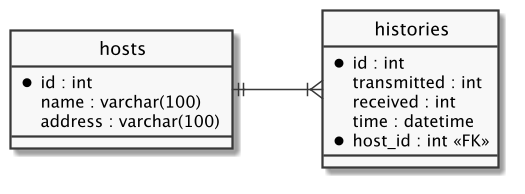
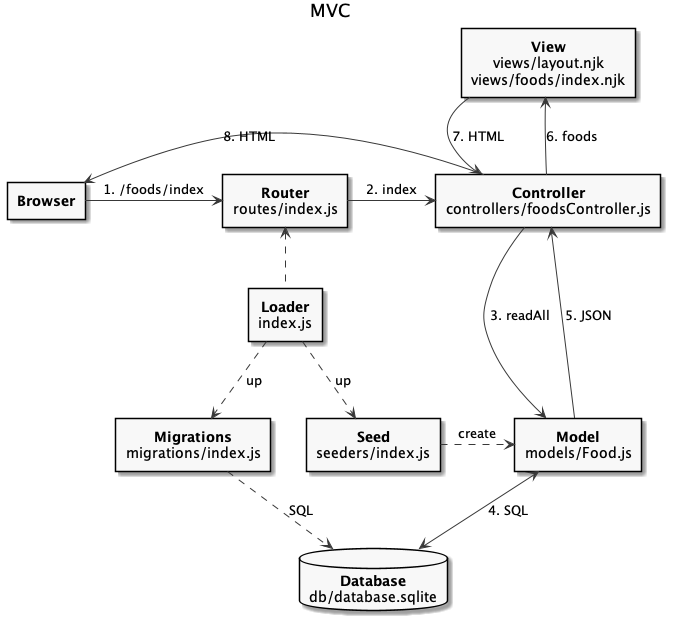
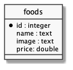

# Database

  - [MySQL](#mysql)
  - [Dataset](#dataset)
  - [Data Definition Language (DDL)](#data-definition-language-ddl)
    - [Database](#database-1)
    - [Table](#table)
  - [Data Manipulation Language (DML)](#data-manipulation-language-dml)
    - [INSERT](#insert)
    - [SELECT](#select)
    - [UPDATE](#update)
    - [DELETE](#delete)
  - [Database Relationships](#database-relationships)
    - [1-N](#1-n)
  - [MVC com Banco de Dados](#mvc-com-banco-de-dados)
  - [Aplicação com SQLite](#aplicação-com-sqlite)
    - [Estrutura de Código](#estrutura-de-código)
    - [Loader](#loader)
    - [Migration](#migration)
    - [Database](#database-2)
    - [Model](#model)
    - [Controller](#controller)
    - [Chamada de Sistema](#chamada-de-sistema)
  - [References](#references)

## MySQL

---

```
$ docker run --name mysql -e MYSQL_ROOT_PASSWORD=secret -d mysql:8.0
```

> [docker-compose.yml](docker-compose.yml):

```yaml

```

> [.env](.env):

```

```

Load database:

```
$ docker-compose up -d
$ docker-compose ps
 Name                Command               State                 Ports
------------------------------------------------------------------------------------
adminer   entrypoint.sh docker-php-e ...   Up      0.0.0.0:8080->8080/tcp
mysql     docker-entrypoint.sh --def ...   Up      0.0.0.0:3306->3306/tcp, 33060/tcp
```

VSCode:
  - [SQLTools](https://marketplace.visualstudio.com/items?itemName=mtxr.sqltools)
  - [SQLTools MySQL/MariaDB](https://marketplace.visualstudio.com/items?itemName=mtxr.sqltools-driver-mysql)
  - [Docker](https://marketplace.visualstudio.com/items?itemName=ms-azuretools.vscode-docker)

Docker:
  - [Adminer](https://hub.docker.com/_/adminer)
  - [MySQL](https://hub.docker.com/_/mysql)

## Dataset

---

| name               | address      | transmitted | received | time                |
|--------------------|--------------|-------------|----------|---------------------|
| portal.ifrn.edu.br | 10.0.0.100   |           4 |        4 | 2018-02-16 13:41:49 |
| portal.ifrn.edu.br | 10.0.0.100   |           8 |        4 | 2018-02-16 13:41:49 |
| portal.ifrn.edu.br | 10.0.0.100   |           4 |        3 | 2018-02-16 13:41:49 |
| ...                | ...          |         ... |      ... | ...                 |
| www.ifpb.edu.br    | 200.10.10.12 |           5 |        5 | 2018-02-18 13:41:49 |

**Questões**

1. Quantos pacotes foram recebidos?
2. Qual é a média de pacotes perdidos?
3. Qual é a porcentagem de pacotes recebidos do IFPB?
4. Qual é a porcentagem de pacotes perdidos do IFPB no dia 16/02/2018 entre 09:00 até 18:00?

## Data Definition Language (DDL)

---

> **DICAS:**
> - Os comandos não são *case sensitive*
> - Os nomes são *case sensitive*
> - Não esqueça do `;` nos comandos
> - Em caso de erro tente interpretar a mensagem de erro

### Database

```sql
> SHOW DATABASES;
+--------------------+
| Database           |
+--------------------+
| information_schema |
| mysql              |
| performance_schema |
+--------------------+
3 rows in set (0.00 sec)
```

```sql
> CREATE DATABASE monitor_db;
Query OK, 1 row affected (0.00 sec)

> SHOW DATABASES;
+--------------------+
| Database           |
+--------------------+
| information_schema |
| monitor_db         |
| mysql              |
| performance_schema |
+--------------------+
4 rows in set (0.00 sec)
```

```sql
> DROP DATABASE monitor_db;
Query OK, 0 rows affected (0.00 sec)

> SHOW DATABASES;
+--------------------+
| Database           |
+--------------------+
| information_schema |
| mysql              |
| performance_schema |
+--------------------+
3 rows in set (0.00 sec)
```

### Table

```sql
> USE monitor_db;
Database changed

> SELECT DATABASE();
+------------+
| DATABASE() |
+------------+
| monitor_db |
+------------+
1 row in set (0.00 sec)
```

```sql
> SHOW TABLES;
Empty set (0.00 sec)
```

```sql
> CREATE TABLE host (
  id int NOT NULL AUTO_INCREMENT,
  name varchar(100) NOT NULL,
  address varchar(100) NOT NULL,
  PRIMARY KEY (id)
);
Query OK, 0 rows affected (0.00 sec)

> SHOW TABLES;
+----------------------+
| Tables_in_monitor_db |
+----------------------+
| host                 |
+----------------------+
1 row in set (0.00 sec)
```

```sql
> DESCRIBE host;
+---------+--------------+------+-----+---------+----------------+
| Field   | Type         | Null | Key | Default | Extra          |
+---------+--------------+------+-----+---------+----------------+
| id      | int          | NO   | PRI | NULL    | auto_increment |
| name    | varchar(100) | NO   |     | NULL    |                |
| address | varchar(100) | NO   |     | NULL    |                |
+---------+--------------+------+-----+---------+----------------+
3 rows in set (0.00 sec)
```

```sql
> DROP TABLE host;
Query OK, 0 rows affected (0.00 sec)

> SHOW TABLES;
+----------------------+
| Tables_in_monitor_db |
+----------------------+
| host                 |
+----------------------+
1 row in set (0.01 sec)
```

```sql
> RENAME TABLE host TO hosts;
Query OK, 0 rows affected (0.00 sec)

> SHOW TABLES;
+----------------------+
| Tables_in_monitor_db |
+----------------------+
| hosts                |
+----------------------+
1 row in set (0.01 sec)
```

```sql
> DESCRIBE hosts;
+---------+--------------+------+-----+---------+----------------+
| Field   | Type         | Null | Key | Default | Extra          |
+---------+--------------+------+-----+---------+----------------+
| id      | int          | NO   | PRI | NULL    | auto_increment |
| name    | varchar(100) | NO   |     | NULL    |                |
| address | varchar(100) | NO   |     | NULL    |                |
+---------+--------------+------+-----+---------+----------------+

> ALTER TABLE hosts ADD COLUMN mask varchar(100);
Query OK, 0 rows affected (0.01 sec)
Records: 0  Duplicates: 0  Warnings: 0

> DESCRIBE hosts;
+---------+--------------+------+-----+---------+----------------+
| Field   | Type         | Null | Key | Default | Extra          |
+---------+--------------+------+-----+---------+----------------+
| id      | int          | NO   | PRI | NULL    | auto_increment |
| name    | varchar(100) | NO   |     | NULL    |                |
| address | varchar(100) | NO   |     | NULL    |                |
| mask    | varchar(100) | YES  |     | NULL    |                |
+---------+--------------+------+-----+---------+----------------+
4 rows in set (0.00 sec)
```

```sql
> ALTER TABLE hosts DROP COLUMN mask;
Query OK, 0 rows affected (0.01 sec)
Records: 0  Duplicates: 0  Warnings: 0

> DESCRIBE hosts;
+---------+--------------+------+-----+---------+----------------+
| Field   | Type         | Null | Key | Default | Extra          |
+---------+--------------+------+-----+---------+----------------+
| id      | int          | NO   | PRI | NULL    | auto_increment |
| name    | varchar(100) | NO   |     | NULL    |                |
| address | varchar(100) | NO   |     | NULL    |                |
+---------+--------------+------+-----+---------+----------------+
3 rows in set (0.00 sec)
```

## Data Manipulation Language (DML)

---

### INSERT

```sql
> INSERT INTO hosts
    VALUES (1, 'www.ifpb.edu.br', '200.10.10.10');
Query OK, 1 row affected (0.01 sec)
```

```sql
> INSERT INTO hosts
      (name, address)
    VALUES
      ('www.ifrn.edu.br', '200.10.10.11'),
      ('www.ifpb.edu.br', '200.10.10.12');
Query OK, 2 rows affected (0.01 sec)
Records: 2  Duplicates: 0  Warnings: 0
```

### SELECT

```sql
> SELECT * FROM hosts;
+----+-----------------+--------------+
| id | name            | address      |
+----+-----------------+--------------+
|  1 | www.ifpb.edu.br | 200.10.10.10 |
|  2 | www.ifrn.edu.br | 200.10.10.11 |
|  3 | www.ifpb.edu.br | 200.10.10.12 |
+----+-----------------+--------------+
3 rows in set (0.00 sec)
```

```sql
> SELECT name, address FROM hosts;
+-----------------+--------------+
| name            | address      |
+-----------------+--------------+
| www.ifpb.edu.br | 200.10.10.10 |
| www.ifrn.edu.br | 200.10.10.11 |
| www.ifpb.edu.br | 200.10.10.12 |
+-----------------+--------------+
3 rows in set (0.00 sec)
```

```sql
> SELECT name, address FROM hosts
    ORDER BY name;
+-----------------+--------------+
| name            | address      |
+-----------------+--------------+
| www.ifpb.edu.br | 200.10.10.10 |
| www.ifpb.edu.br | 200.10.10.12 |
| www.ifrn.edu.br | 200.10.10.11 |
+-----------------+--------------+
3 rows in set (0.01 sec)
```

```sql
> SELECT name, address FROM hosts
    WHERE id = 1;
+-----------------+--------------+
| name            | address      |
+-----------------+--------------+
| www.ifpb.edu.br | 200.10.10.10 |
+-----------------+--------------+
1 row in set (0.00 sec)
```

```sql
> SELECT name, address FROM hosts
    WHERE name LIKE '%ifpb%' AND address LIKE '200.%.%.%';
+-----------------+--------------+
| name            | address      |
+-----------------+--------------+
| www.ifpb.edu.br | 200.10.10.10 |
| www.ifpb.edu.br | 200.10.10.12 |
+-----------------+--------------+
2 rows in set (0.00 sec)
```

```sql
> SELECT * FROM hosts
    LIMIT 2;
+----+-----------------+--------------+
| id | name            | address      |
+----+-----------------+--------------+
|  1 | www.ifpb.edu.br | 200.10.10.10 |
|  2 | www.ifrn.edu.br | 200.10.10.11 |
+----+-----------------+--------------+
2 rows in set (0.00 sec)
```

```sql
> SELECT * FROM hosts
    LIMIT 2
    OFFSET 1;
+----+-----------------+--------------+
| id | name            | address      |
+----+-----------------+--------------+
|  2 | www.ifrn.edu.br | 200.10.10.11 |
|  3 | www.ifpb.edu.br | 200.10.10.12 |
+----+-----------------+--------------+
2 rows in set (0.00 sec)
```

```sql
> SELECT COUNT(*) AS total FROM hosts;
+-------+
| total |
+-------+
|     3 |
+-------+
1 row in set (0.00 sec)
```

### UPDATE

```sql
> UPDATE hosts
    SET address = '10.0.0.10'
    WHERE id = 2;
Query OK, 1 row affected (0.01 sec)
Rows matched: 1  Changed: 1  Warnings: 0

> SELECT * FROM hosts
    WHERE id = 2;
+----+-----------------+-----------+
| id | name            | address   |
+----+-----------------+-----------+
|  2 | www.ifrn.edu.br | 10.0.0.10 |
+----+-----------------+-----------+
1 row in set (0.00 sec)
```

```sql
> UPDATE hosts
    SET name = 'portal.ifrn.edu.br', address = '10.0.0.100'
    WHERE id = 2;
Query OK, 1 row affected (0.01 sec)
Rows matched: 1  Changed: 1  Warnings: 0

> SELECT * FROM hosts
    WHERE id = 2;
+----+--------------------+------------+
| id | name               | address    |
+----+--------------------+------------+
|  2 | portal.ifrn.edu.br | 10.0.0.100 |
+----+--------------------+------------+
```

### DELETE

```sql
> SELECT * FROM hosts;
+----+-----------------+--------------+
| id | name            | address      |
+----+-----------------+--------------+
|  1 | www.ifpb.edu.br | 200.10.10.10 |
+----+-----------------+--------------+

> DELETE FROM hosts
    WHERE id = 1;
Query OK, 1 row affected (0.01 sec)

> SELECT * FROM hosts
    WHERE id = 1;
Empty set (0.00 sec)
```

> **DICA:** Muito cuidado com o `DELETE` e `UPDATE` sem o `WHERE`!

## Database Relationships

---

###  1-N



```sql
> CREATE TABLE histories (
    id int NOT NULL AUTO_INCREMENT,
    transmitted int NOT NULL,
    received int NOT NULL,
    time datetime NOT NULL,
    host_id int NOT NULL,
    PRIMARY KEY (id),
    KEY host_id (host_id),
    CONSTRAINT fk_host_id FOREIGN KEY (host_id) REFERENCES hosts (id)
);
Query OK, 0 rows affected (0.02 sec)
```

```sql
> DESCRIBE histories;
+-------------+------+------+-----+---------+----------------+
| Field       | Type | Null | Key | Default | Extra          |
+-------------+------+------+-----+---------+----------------+
| id          | int  | NO   | PRI | NULL    | auto_increment |
| transmitted | int  | YES  |     | NULL    |                |
| received    | int  | YES  |     | NULL    |                |
| time        | time | YES  |     | NULL    |                |
| host_id     | int  | YES  | MUL | NULL    |                |
+-------------+------+------+-----+---------+----------------+
5 rows in set (0.00 sec)
```

```sql
> INSERT INTO histories
    (transmitted, received, time, host_id)
  VALUES
    (4, 4, NOW(), 2),
    (8, 4, NOW(), 2),
    (7, 4, NOW(), 3),
    (5, 5, NOW(), 3),
    (4, 3, NOW(), 2);
Query OK, 5 rows affected (0.01 sec)
Records: 5  Duplicates: 0  Warnings: 0

> SELECT * FROM histories;
+----+-------------+----------+---------------------+---------+
| id | transmitted | received | time                | host_id |
+----+-------------+----------+---------------------+---------+
|  1 |           4 |        4 | 2018-02-16 13:41:49 |       2 |
|  2 |           8 |        4 | 2018-02-16 13:41:49 |       2 |
|  3 |           7 |        4 | 2018-02-16 13:41:49 |       3 |
|  4 |           5 |        5 | 2018-02-16 13:41:49 |       3 |
|  5 |           4 |        3 | 2018-02-16 13:41:49 |       2 |
+----+-------------+----------+---------------------+---------+
5 rows in set (0.00 sec)
```

```sql
> SELECT
    *
  FROM
    hosts INNER JOIN histories;
+----+--------------------+--------------+----+-------------+----------+---------------------+---------+
| id | name               | address      | id | transmitted | received | time                | host_id |
+----+--------------------+--------------+----+-------------+----------+---------------------+---------+
|  2 | portal.ifrn.edu.br | 10.0.0.100   |  1 |           4 |        4 | 2018-02-16 13:41:49 |       2 |
|  3 | www.ifpb.edu.br    | 200.10.10.12 |  1 |           4 |        4 | 2018-02-16 13:41:49 |       2 |
|  2 | portal.ifrn.edu.br | 10.0.0.100   |  2 |           8 |        4 | 2018-02-16 13:41:49 |       2 |
|  3 | www.ifpb.edu.br    | 200.10.10.12 |  2 |           8 |        4 | 2018-02-16 13:41:49 |       2 |
|  2 | portal.ifrn.edu.br | 10.0.0.100   |  3 |           7 |        4 | 2018-02-16 13:41:49 |       3 |
|  3 | www.ifpb.edu.br    | 200.10.10.12 |  3 |           7 |        4 | 2018-02-16 13:41:49 |       3 |
|  2 | portal.ifrn.edu.br | 10.0.0.100   |  4 |           5 |        5 | 2018-02-16 13:41:49 |       3 |
|  3 | www.ifpb.edu.br    | 200.10.10.12 |  4 |           5 |        5 | 2018-02-16 13:41:49 |       3 |
|  2 | portal.ifrn.edu.br | 10.0.0.100   |  5 |           4 |        3 | 2018-02-16 13:41:49 |       2 |
|  3 | www.ifpb.edu.br    | 200.10.10.12 |  5 |           4 |        3 | 2018-02-16 13:41:49 |       2 |
+----+--------------------+--------------+----+-------------+----------+---------------------+---------+
10 rows in set (0.00 sec)
```

```sql
> SELECT
    *
  FROM
    hosts INNER JOIN histories
  WHERE
    hosts.id = histories.host_id;
+----+--------------------+--------------+----+-------------+----------+---------------------+---------+
| id | name               | address      | id | transmitted | received | time                | host_id |
+----+--------------------+--------------+----+-------------+----------+---------------------+---------+
|  2 | portal.ifrn.edu.br | 10.0.0.100   |  1 |           4 |        4 | 2018-02-16 13:41:49 |       2 |
|  2 | portal.ifrn.edu.br | 10.0.0.100   |  2 |           8 |        4 | 2018-02-16 13:41:49 |       2 |
|  2 | portal.ifrn.edu.br | 10.0.0.100   |  5 |           4 |        3 | 2018-02-16 13:41:49 |       2 |
|  3 | www.ifpb.edu.br    | 200.10.10.12 |  3 |           7 |        4 | 2018-02-16 13:41:49 |       3 |
|  3 | www.ifpb.edu.br    | 200.10.10.12 |  4 |           5 |        5 | 2018-02-16 13:41:49 |       3 |
+----+--------------------+--------------+----+-------------+----------+---------------------+---------+
5 rows in set (0.00 sec)
```

```sql
> SELECT
    sum(histories.received) AS received,
    sum(histories.transmitted) AS transmitted,
    round(sum(histories.received)/sum(histories.transmitted), 2) AS percent
  FROM
    hosts INNER JOIN histories
  WHERE
    hosts.id = histories.host_id AND
    hosts.name LIKE '%ifpb%';
+----------+-------------+---------+
| received | transmitted | percent |
+----------+-------------+---------+
|        9 |          12 |    0.75 |
+----------+-------------+---------+
1 row in set (0.00 sec)
```

```sql
> exit
Bye
```

## MVC com Banco de Dados

---



## Aplicação com SQLite

---

### Estrutura de Código

```
foods-app
├── .gitignore
├── package-lock.json
├── package.json
├── public
│   ├── css
│   │   └── bootstrap.min.css
│   ├── foods.html
│   ├── imgs
│   │   ├── hamburguer.jpg
│   │   ├── salada.jpg
│   │   └── sanduiche.jpg
│   └── js
│       ├── bootstrap.min.js
│       ├── jquery.min.js
│       └── popper.min.js
└── src
    ├── controllers
    │   └── foodsController.js
    ├── db
    │   ├── database.sqlite
    │   └── index.js
    ├── index.js
    ├── migrations
    │   └── index.js
    ├── models
    │   └── Food.js
    ├── routes
    │   └── index.js
    ├── seeders
    │   └── index.js
    └── views
        ├── foods
        │   └── index.njk
        └── layout.njk
```

[](https://codesandbox.io/s/express-foods-app-sqlite-simple-y472j?fontsize=14&hidenavigation=1&theme=dark)

### Loader

src/index.js:

```js

```

```bash
$ npm install express nunjucks
```

### Migration

[vscode-sqlite](https://marketplace.visualstudio.com/items?itemName=alexcvzz.vscode-sqlite):



src/migrations/index.js:

```js

```

### Database


src/db/index.js:

```js

```

```bash
$ npm install sqlite-async
```

### Model

src/models/Food.js:

```js

```

### Controller

src/controllers/foodsController.js:

```js

```

### Chamada de Sistema

[](https://codesandbox.io/s/top-app-db-2bw2o?fontsize=14&hidenavigation=1&theme=dark)


## References

---

- [enochtangg/quick-SQL-cheatsheet](https://github.com/enochtangg/quick-SQL-cheatsheet)
- [MySQL - SQL Statement Syntax](https://dev.mysql.com/doc/refman/5.7/en/sql-syntax.html)
- Mysql: [Data types](https://www.tutorialspoint.com/mysql/mysql-data-types.htm), [Functions](https://www.w3schools.com/sql/sql_ref_mysql.asp), [Operators](https://www.w3schools.com/sql/sql_operators.asp)
- [Oracle - Database SQL Language Reference](https://docs.oracle.com/database/121/SQLRF/toc.htm)
- SQL Tutorial: [W3Schools](https://www.w3schools.com/sql/default.asp) e [TutorialsPoint](https://www.tutorialspoint.com/sql/index.htm)
- SQL cheat sheet: [Websitesetup](https://websitesetup.org/sql-cheat-sheet/), [ZeroTurnaround](https://zeroturnaround.com/rebellabs/sql-cheat-sheet/), [cse.unl.edu](http://cse.unl.edu/~sscott/ShowFiles/SQL/CheatSheet/SQLCheatSheet.html), [hofmannsven](https://gist.github.com/hofmannsven/9164408), [sqltutorial](http://www.sqltutorial.org/sql-cheat-sheet/)
