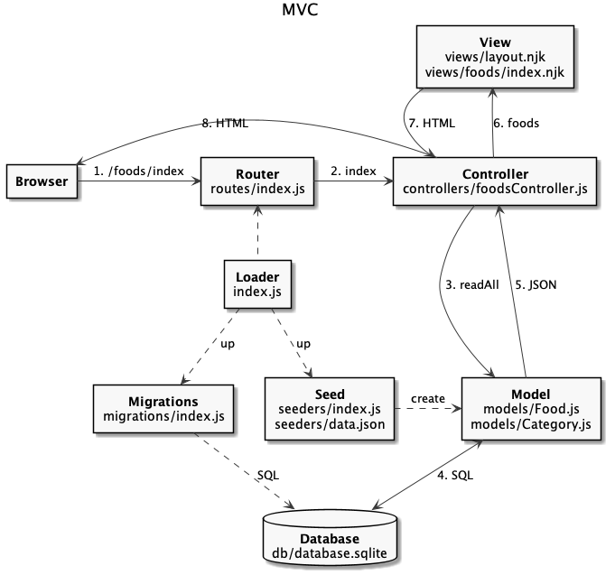
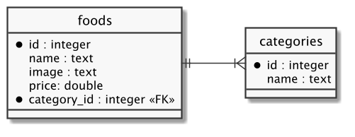
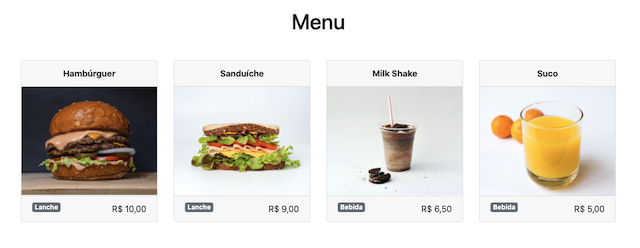
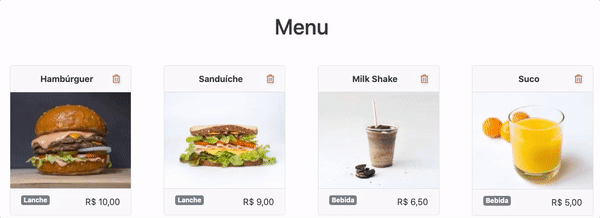
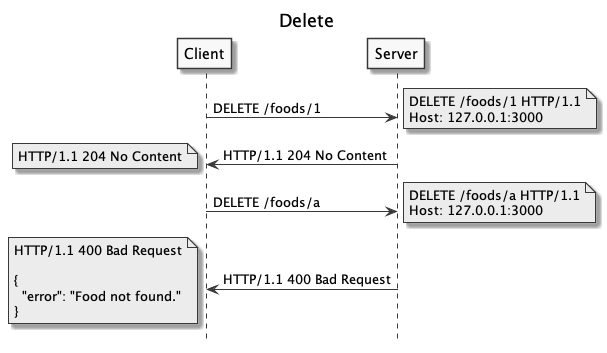
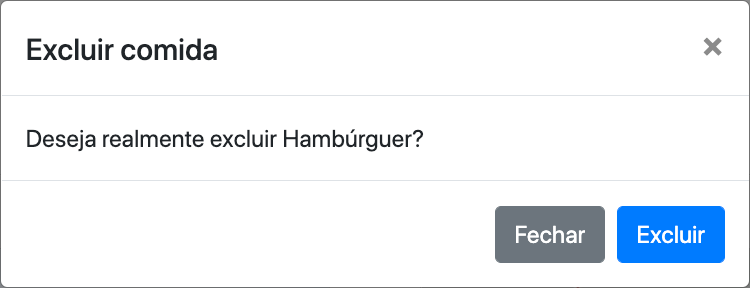

# Manipulação com Banco de Dados

  - [Relacionamento no Banco de Dados](#relacionamento-no-banco-de-dados)
    - [Arquitetura da Aplicação](#arquitetura-da-aplicação)
    - [Entidades do Banco](#entidades-do-banco)
    - [Estrutura de Código](#estrutura-de-código)
    - [Migration](#migration)
    - [Seeders](#seeders)
    - [Model](#model)
    - [View](#view)
  - [Integração com Front-end](#integração-com-front-end)
    - [Arquitetura do Código](#arquitetura-do-código)
    - [Exclusão de Comida](#exclusão-de-comida)
    - [Estrutura de Código](#estrutura-de-código-1)
    - [Router](#router)
    - [Controller](#controller)
    - [Model](#model-1)
    - [View](#view-1)
    - [CRUD de Comida](#crud-de-comida)

## Relacionamento no Banco de Dados

---

### Arquitetura da Aplicação



### Entidades do Banco



### Estrutura de Código


```
foods-app
├── .gitignore
├── package-lock.json
├── package.json
├── public
│   ├── css
│   │   └── bootstrap.min.css
│   ├── foods.html
│   ├── imgs
│   │   ├── hamburguer.jpg
│   │   ├── milkshake.jpg
│   │   ├── sanduiche.jpg
│   │   └── suco.jpg
│   └── js
│       ├── bootstrap.min.js
│       ├── jquery.min.js
│       └── popper.min.js
└── src
    ├── controllers
    │   └── foodsController.js
    ├── db
    │   ├── database.sqlite
    │   └── index.js
    ├── index.js
    ├── migrations
    │   └── index.js
    ├── models
    │   ├── Category.js
    │   └── Food.js
    ├── routes
    │   └── index.js
    ├── seeders
    │   ├── data.json
    │   └── index.js
    └── views
        ├── foods
        │   └── index.njk
        └── layout.njk
```

[](https://codesandbox.io/s/express-foods-app-sqlite-has-many-2c981?fontsize=14&hidenavigation=1&theme=dark)

### Migration


src/migrations/index.js:

```js

```

### Seeders

src/seeders/data.json:

```json

```

src/seeders/index.js:

```js

```

### Model

src/models/Food.js:

```js

```

src/models/Category.js:

```js

```

### View

src/views/foods/index.njk:

```html






<h1 class="my-5 text-center">{{ title }}</h1>

<section class="card-deck">
  
  <div class="col-sm-6 col-lg-4 col-xl-3 mb-3">
    <div class="card">
      <div class="card-header text-center font-weight-bold">
        {{ food.name }}
      </div>
      <div class="card-body p-0">
        
      </div>
      <div class="card-footer text-right">
        <span class="food-category float-left badge badge-secondary">{{ food.category }}</span>
        <span class="food-price">{{ food.price }}</span>
      </div>
    </div>
  </div>
  
</section>



<script>
  const prices = document.querySelectorAll('.card-footer .food-price');
  prices.forEach((price) => {
    price.innerHTML = Intl.NumberFormat('pt-BR', {
      style: 'currency',
      currency: 'BRL',
    }).format(price.innerHTML)
  });
</script>


```



## Integração com Front-end

---

### Arquitetura do Código


### Exclusão de Comida



### Estrutura de Código

```
├── .gitignore
├── package-lock.json
├── package.json
├── public
│   ├── css
│   │   └── bootstrap.min.css
│   ├── foods.html
│   ├── imgs
│   │   ├── hamburguer.jpg
│   │   ├── milkshake.jpg
│   │   ├── sanduiche.jpg
│   │   └── suco.jpg
│   └── js
│       ├── bootstrap.min.js
│       ├── jquery.min.js
│       ├── popper.min.js
│       └── services
│           └── api.js
├── requests.http
└── src
    ├── controllers
    │   └── foodsController.js
    ├── db
    │   ├── database.sqlite
    │   └── index.js
    ├── index.js
    ├── migrations
    │   └── index.js
    ├── models
    │   ├── Category.js
    │   └── Food.js
    ├── routes
    │   └── index.js
    ├── seeders
    │   ├── data.json
    │   └── index.js
    └── views
        ├── foods
        │   ├── _delete.njk
        │   └── index.njk
        └── layout.njk
```

[](https://codesandbox.io/s/foods-app-sqlite-delete-z65bm?fontsize=14&hidenavigation=1&theme=dark)

### Router



src/routes/index.js:

```js

```

### Controller

src/controllers/foodsController.js:

```js
const Food = require('../models/Food');

...

const destroy = async (req, res) => {
  const { id } = req.params;

  const result = await Food.destroy(id);

  if (result) {
    res.status(204).send();
  } else {
    return res.status(400).json({ error: 'Food not found.' });
  }
};

...
```

### Model

src/models/Food.js:

```js
const { conn } = require('../db');

...

async function destroy(id) {
  const sql = `
    DELETE FROM
      foods
    WHERE
      id = ?
  `;

  const db = await conn();

  const { changes } = await db.run(sql, [id]);

  return changes;
}

...
```

### View

src/views/foods/_delete.njk:

```html

<div class="modal fade" id="deleteFoodModal" tabindex="-1" aria-labelledby="deleteFoodLabel" aria-hidden="true">
  <div class="modal-dialog">
    <div class="modal-content">
      <div class="modal-header">
        <h5 class="modal-title" id="deleteFoodLabel">Excluir comida</h5>
        <button type="button" class="close" data-dismiss="modal" aria-label="Close">
          <span aria-hidden="true">&times;</span>
        </button>
      </div>
      <div class="modal-body">
        Deseja realmente excluir <span id="modal-name-food"></span>?
      </div>
      <div class="modal-footer">
        <button type="button" class="btn btn-secondary" data-dismiss="modal">Fechar</button>
        <button type="button" class="btn btn-primary" id="deleteFoodBtn">Excluir</button>
      </div>
    </div>
  </div>
</div>

```



src/views/foods/index.njk:

```html


...

...
<section class="card-deck">
  
  <div class="card-food col-sm-6 col-lg-4 col-xl-3 mb-3" id="food-{{ food.id }}">
    <div class="card">
      <div class="card-header text-center font-weight-bold">
        <span class="food-name">
          {{ food.name }}
        </span>
        <span class="food-delete float-right text-danger">
          <i
            class="far fa-trash-alt"
            onclick="deleteFoodView({{ food.id }}, '{{ food.name }}')">
          </i>
        </span>
      </div>
      ...
    </div>
  </div>
  
</section>




<script type="module">
  import api from '/js/services/api.js';

  ...

  function deleteFoodView(foodId, foodName) {
    $('#deleteFoodModal').modal('toggle');

    document.querySelector('#modal-name-food').innerHTML = foodName;

    document.querySelector('#deleteFoodBtn').onclick = async (e) => {
      e.preventDefault();

      await api.destroy(`/foods/${foodId}`);

      document.querySelector(`#food-${ foodId }`).remove();

      $('#deleteFoodModal').modal('toggle');
    };
  }

  window.deleteFoodView = deleteFoodView;

  ...
</script>


```

public/js/services/api.js:

```js
const domain = '';

...

async function destroy(resource) {
  await fetch(`${domain}${resource}`, {
    method: 'delete',
  });
}

...
```

### CRUD de Comida

[](https://codesandbox.io/s/foods-app-sqlite-kq0tl?fontsize=14&hidenavigation=1&theme=dark)
